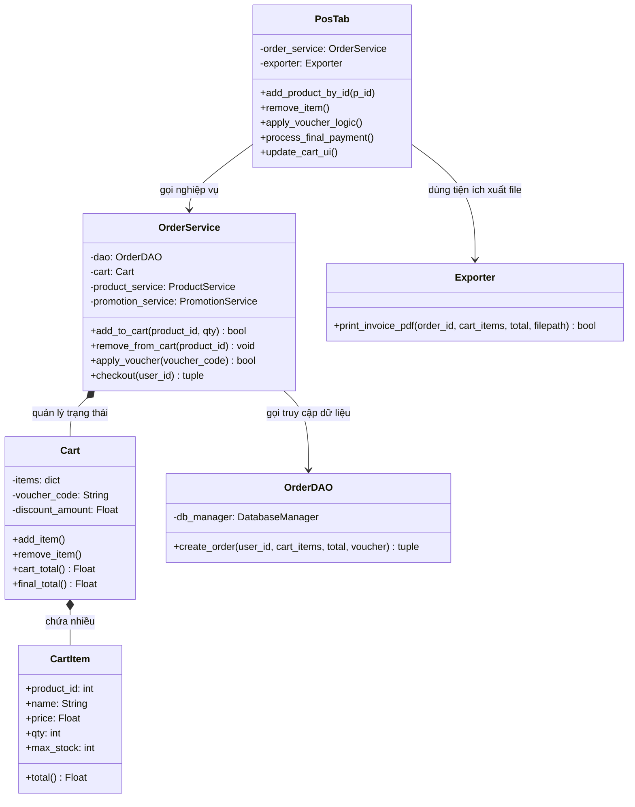

# Sơ Đồ Lớp (Class Diagram) - Kiến trúc 3 lớp đã Refactor

Sơ đồ này thể hiện mối quan hệ giữa các lớp trong chức năng Giỏ hàng và Thanh toán, minh chứng cho sự tách biệt rõ ràng giữa GUI (PosTab), Tầng xử lý nghiệp vụ (OrderService, Cart) và Tầng truy cập dữ liệu (OrderDAO).

Bạn có thể copy mã nguồn bên dưới dán vào trang web **https://mermaid.live/** để xuất ra file ảnh (PNG/JPG) chèn vào báo cáo Word.

