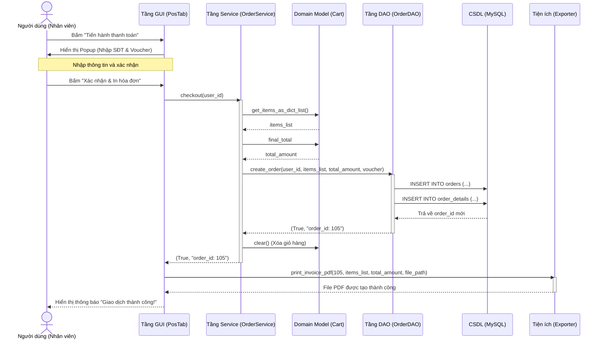

# Sơ Đồ Tuần Tự (Sequence Diagram) - Luồng Thanh Toán (Checkout)

Sơ đồ này mô tả chi tiết các bước trao đổi thông điệp (Message passing) từ lúc người dùng nhấn nút thanh toán trên giao diện cho đến khi dữ liệu lưu vào MySQL và in ra hóa đơn PDF.

Bạn có thể copy mã nguồn bên dưới dán vào trang web **https://mermaid.live/** để xuất ra file ảnh (PNG/JPG) chèn vào báo cáo Word.

